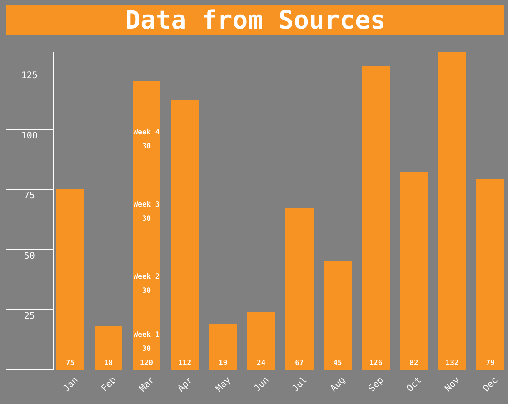

# lhl-prep-stretch
Lighthouse Labs Prep Material Stretch Project

## About
The prep material for Lighthouse Labs' Web Development bootcamp contains an optional project to work on if extra time is available before the start of bootcamp. This is my attempt at it.

## Screenshots


## Feature List
- Display bar chart of values as an HTML chart
- Display stacked bars 
- Customize chart appearance
- Display multiple charts 

## Functionality
There is only one function facing the user, the `draw.barChart()` method. Its arguments, in order, are `data, options, element`.
#### `data`
The user may pass in either an array of numerical values, or an array of objects to be displayed as a graph. The available object keys are as follows:
- `name` (optional) a text string associated with the data.
- `value` the numerical quantity to be displayed. You may also nest an array of objects structured with `name` (optional) and `value`. 
#### `options`
There are a number of options that may be passed in that affect the display of the bar graph. These are passed as key value pairs in an object. The available options are as follows:
```js
{
  // height of entire graph in px
  height: 350, 

  // color of graph bars
  barColor: 'darkorange', 

  // width of bars in %
  barWidth: 75, 

  // color of data labels in bars
  labelColor: 'white', 

  // size of data labels in bars in px
  labelSize: 8, 

  // position of data labels in bars 
  labelPosition: 'bottom', 

  // title of the chart
  chartTitle: 'Data from Sources', 

  // font size of the title in px
  titleSize: 28, 

  // font color and background color of the title, respectively
  titleColor: ['white', 'darkorange'], 

  // font and tic color of axis labels
  axisColor: 'white',

  // font size of x axis labels in px
  xAxisSize: 10,

  // clockwise rotation of x asis labels in degrees
  xAxisRotation: 315,

  // quantity stepping of y axis label tics
  yAxisStep: 25,

  // background color of entire page
  backgroundColor: 'grey'
}
```
#### `element`
This passes a class name to the top level `div` of the chart.

## Known Issues
- Labels may be cut off inside the bar if label is too long
- Long bar names overflow the axis area

## Roadmap
- On page instructions
- Automatic color separation in stacked bars
- JSON file upload through drag and drop
- Leaders for labels that are too long to fit in the bar
- Shadows and appearance improvements
- Animations


## Reference Material
- Reference gist for project setup https://gist.github.com/daegren/24a18989683213fe6fb934fc4f789db4
- Setting up jQuery https://jquery.com/download/#downloading-jquery-using-npm-or-yarn
- Using jQuery https://www.w3schools.com/jquery/jquery_get_started.asp
- jQuery cheatsheet https://oscarotero.com/jquery/
- jQuery tips https://tuts.alexmercedcoder.com/2021/8/js_jquery_cheatsheet/
- Closure for a jQuery plugin (very helpful!) https://stackoverflow.com/a/18189454
